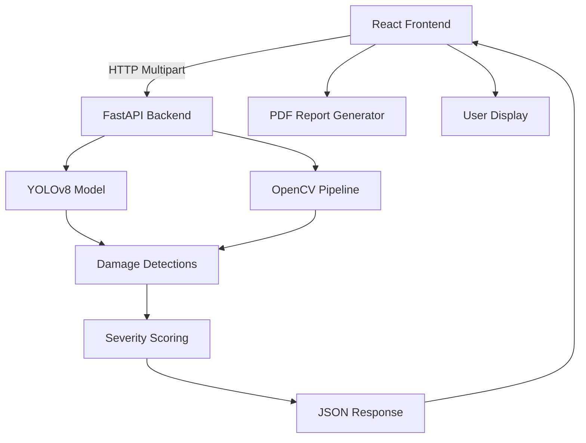

<p align="center">
  
  
</p>

# 🛡️ Baggage Guardian

**AI-Powered Baggage Damage Verification System**

Baggage Guardian is a production-grade application that uses computer vision and deep learning to automatically detect and assess damage to luggage by comparing pre-flight and post-flight photographs. Built with **YOLOv8** for object detection, **OpenCV** for pixel-level difference analysis, **FastAPI** for a high-performance backend, and **React + TypeScript** for a modern, responsive frontend..

---

## 📋 Table of Contents

- [Overview](#-overview)
- [Key Features](#-key-features)
- [System Architecture](#-system-architecture)
- [Technology Stack](#-technology-stack)
- [How It Works](#-how-it-works)
- [Project Structure](#-project-structure)
- [Getting Started](#-getting-started)
  - [Prerequisites](#prerequisites)
  - [Backend Setup](#backend-setup)
  - [Frontend Setup](#frontend-setup)
- [API Reference](#-api-reference)
- [Testing](#-testing)
- [Deployment](#-deployment)
- [Contributing](#-contributing)
- [License](#-license)

---

## 🔍 Overview

Every year, millions of travelers experience baggage damage during air travel. Filing claims is tedious, subjective, and often lacks objective evidence. **Baggage Guardian** solves this by providing:

- **Objective damage verification** using AI — not human guesswork
- **Pixel-level comparison** between pre-flight and post-flight photos
- **Severity scoring** (None / Low / Medium / High) backed by quantifiable metrics
- **Exportable PDF reports** suitable for insurance claims and airline disputes
- **A beautiful, intuitive UI** that guides users through a 3-step workflow

---

## ✨ Key Features

### 🔬 Hybrid AI Detection Engine
- **YOLOv8** deep learning model detects damage regions with bounding boxes
- **OpenCV** pixel-difference pipeline refines each detection and serves as a fallback when YOLO finds nothing
- **Adaptive thresholding** catches faint damage (scratches, scuffs) that traditional methods miss

### 📊 Intelligent Severity Scoring
- Damage-to-bag area ratio determines severity: `<5%` → Low, `5–15%` → Medium, `>15%` → High
- Per-image and global (worst-case across all images) severity ratings
- Color-coded badges for instant visual comprehension

### 📄 One-Click PDF Reports
- Generates a professional damage report with timestamp, severity rating, and annotated images
- Bounding boxes drawn directly on the primary (most damaged) image
- Ready for submission to airlines or insurance providers

### 🎨 Production-Grade UI/UX
- Dark-themed, responsive design with glassmorphism styling
- 3-step stepper: Upload → AI Analysis → Report
- Photo tips sidebar to help users capture optimal images
- Real-time image previews with bounding box overlays

---

## 🏗️ System Architecture



### Data Flow

1. **User uploads** one pre-flight baseline photo and one or more post-flight photos via the React UI
2. **Frontend sends** images as `multipart/form-data` to the FastAPI `/api/analyze` endpoint
3. **Backend processes** each post-flight image through the hybrid pipeline:
   - YOLOv8 runs inference to detect potential damage regions
   - For each YOLO detection, OpenCV computes a pixel-difference mask between pre and post ROIs
   - If YOLO finds nothing, a full-image OpenCV fallback activates
4. **Severity is computed** per detection, per image, and globally
5. **Results return** as structured JSON with bounding boxes, severity labels, and metadata
6. **Frontend renders** annotated images with color-coded overlays and offers PDF export

---

## 🛠️ Technology Stack

| Layer | Technology | Purpose |
|-------|-----------|---------|
| **AI/ML** | [Ultralytics YOLOv8](https://github.com/ultralytics/ultralytics) | Object detection for damage regions |
| **Computer Vision** | [OpenCV](https://opencv.org/) | Pixel-difference analysis, contour extraction, morphological operations |
| **Backend Framework** | [FastAPI](https://fastapi.tiangolo.com/) | High-performance async REST API with automatic OpenAPI docs |
| **Backend Server** | [Uvicorn](https://www.uvicorn.org/) | ASGI server with hot reload for development |
| **Frontend Framework** | [React 19](https://react.dev/) | Component-based UI with hooks |
| **Language** | [TypeScript](https://www.typescriptlang.org/) | Type-safe frontend development |
| **Build Tool** | [Vite](https://vite.dev/) | Fast dev server and optimized production builds |
| **HTTP Client** | [Axios](https://axios-http.com/) | Promise-based HTTP requests |
| **PDF Generation** | [jsPDF](https://github.com/parallax/jsPDF) | Client-side PDF report generation |
| **Testing** | `unittest` (Python) | Backend unit tests |

---

## ⚙️ How It Works

### The Hybrid Detection Pipeline

```
┌─────────────────────────────────────────────────────────┐
│                  analyze_single_post_image()             │
├─────────────────────────────────────────────────────────┤
│  1. YOLOv8 Inference                                    │
│     ├─ Run model on post-flight image                   │
│     ├─ Filter to damage class (class_id=0)              │
│     └─ Extract bounding boxes                           │
│                                                         │
│  2. OpenCV ROI Refinement (per YOLO detection)          │
│     ├─ Crop pre & post ROIs from bounding box           │
│     ├─ Grayscale + Gaussian blur                        │
│     ├─ Absolute difference                              │
│     ├─ Adaptive thresholding                            │
│     ├─ Morphological open/close/dilate                  │
│     └─ Contour extraction & area measurement            │
│                                                         │
│  3. OpenCV Full-Image Fallback (if no YOLO detections)  │
│     ├─ Run diff pipeline on entire images               │
│     ├─ Extract largest damage contour                   │
│     └─ Report as "opencv-fallback" method               │
│                                                         │
│  4. Severity Scoring                                    │
│     ├─ Per-detection: damage_area / box_area            │
│     ├─ Per-image: total_damage / bag_area               │
│     └─ Global: max severity across all images           │
└─────────────────────────────────────────────────────────┘
```

### Severity Thresholds

| Severity | Damage Ratio | Color | Meaning |
|----------|-------------|-------|---------|
| **None** | 0% | Gray | No detectable damage |
| **Low** | < 5% | Green | Minor scuffs or scratches |
| **Medium** | 5–15% | Yellow | Noticeable damage, claim recommended |
| **High** | > 15% | Red | Significant damage, urgent claim |

---

## 📁 Project Structure

```
BaggageGuardian_Project/
├── README.md                          ← You are here
├── ARCHITECTURE.md                    ← Detailed architecture docs
├── CONTRIBUTING.md                    ← Contribution guidelines
├── LICENSE                            ← MIT License
│
├── backend/
│   ├── main.py                        ← FastAPI application & /api/analyze endpoint
│   ├── damage_model.py                ← YOLOv8 model loader (LRU-cached singleton)
│   ├── damage_service.py              ← Core hybrid detection & severity logic
│   ├── requirements.txt               ← Python dependencies
│   ├── README.md                      ← Backend-specific documentation
│   ├── weights/
│   │   └── baggage_damage.pt          ← Trained YOLOv8 model weights
│   └── tests/
│       └── test_damage_service.py     ← Unit tests for detection pipeline
│
└── frontend/
    ├── index.html                     ← HTML entry point
    ├── package.json                   ← Node dependencies & scripts
    ├── vite.config.ts                 ← Vite configuration
    ├── tsconfig.json                  ← TypeScript configuration
    ├── eslint.config.js               ← ESLint configuration
    ├── README.md                      ← Frontend-specific documentation
    ├── public/                        ← Static assets
    └── src/
        ├── main.tsx                   ← React entry point
        ├── App.tsx                    ← Root component with state management
        ├── App.css                    ← Global styles (dark theme, glassmorphism)
        ├── index.css                  ← Base CSS reset
        ├── types.ts                   ← TypeScript type definitions
        ├── assets/                    ← Images and static resources
        └── components/
            ├── UploadStep.tsx         ← Image upload UI with previews
            ├── ResultsStep.tsx        ← Analysis results with bounding box overlays
            ├── PdfReportButton.tsx    ← Client-side PDF report generation
            ├── SeverityBadge.tsx      ← Color-coded severity indicator
            ├── Stepper.tsx            ← 3-step progress indicator
            └── PhotoTipsPanel.tsx     ← Sidebar with photography guidance
```

---

## 🚀 Getting Started

### Prerequisites

- **Python 3.10+** with `pip`
- **Node.js 18+** with `npm`
- Trained YOLOv8 model weights at `backend/weights/baggage_damage.pt`

### Backend Setup

```bash
cd backend

# Create and activate a virtual environment (recommended)
python -m venv .venv
source .venv/bin/activate  # macOS/Linux
# .venv\Scripts\activate   # Windows

# Install dependencies
pip install -r requirements.txt

# Start the API server (with hot reload)
uvicorn main:app --reload --host 0.0.0.0 --port 8000
```

The API will be available at `http://localhost:8000`. Interactive API docs (Swagger UI) are at `http://localhost:8000/docs`.

### Frontend Setup

```bash
cd frontend

# Install dependencies
npm install

# Start the development server
npm run dev
```

The frontend will be available at `http://localhost:5173` (default Vite port).

### Verify Everything Works

1. Open `http://localhost:5173` in your browser
2. Upload a pre-flight photo and at least one post-flight photo
3. Click **"Run AI Analysis"**
4. View results with bounding box overlays
5. Click **"Generate PDF Report"** to download a damage report

---

## 📡 API Reference

### `POST /api/analyze`

Analyzes baggage images for damage using the hybrid YOLOv8 + OpenCV pipeline.

**Request** (`multipart/form-data`):

| Field | Type | Required | Description |
|-------|------|----------|-------------|
| `pre_image` | `file` (image) | Yes | Single baseline photo taken before the flight |
| `post_images` | `file[]` (image) | Yes | One or more photos taken after the flight |

**Response** (`application/json`):

```typescript
{
  global_severity: "none" | "low" | "medium" | "high",
  primary_image_index: number,
  images: [
    {
      image_index: number,
      filename: string,
      image_width: number,
      image_height: number,
      image_severity: "none" | "low" | "medium" | "high",
      used_fallback: boolean,
      detections: [
        {
          box: {
            xmin: number, ymin: number,
            xmax: number, ymax: number,
            xmin_norm: number, ymin_norm: number,
            xmax_norm: number, ymax_norm: number
          },
          local_damage_area: number,
          box_area: number,
          severity: "none" | "low" | "medium" | "high",
          method: "yolo+opencv" | "opencv-fallback"
        }
      ]
    }
  ]
}
```

**Status Codes**:
- `200` — Analysis completed successfully
- `422` — Validation error (missing or invalid files)
- `500` — Internal server error

---

## 🧪 Testing

### Backend Tests

```bash
cd backend
python -m pytest tests/ -v
# or
python -m unittest discover tests/
```

Current test coverage includes:
- Fallback detection validation (small damage region triggers OpenCV fallback)
- Detection pipeline integration tests

### Frontend (Coming Soon)

```bash
cd frontend
npm run lint        # ESLint static analysis
npm run build       # TypeScript compilation check
```

---

## 🚢 Deployment

### Backend (Production)

```bash
cd backend
uvicorn main:app --host 0.0.0.0 --port 8000 --workers 4
```

For production deployments, consider:
- Running behind **nginx** as a reverse proxy
- Using **Gunicorn** with Uvicorn workers: `gunicorn main:app -w 4 -k uvicorn.workers.UvicornWorker`
- Containerizing with **Docker**
- Setting `allow_origins` in CORS middleware to your specific frontend domain

### Frontend (Production)

```bash
cd frontend
npm run build        # Outputs to dist/
```

Serve the `dist/` directory with any static file server (nginx, Vercel, Netlify, AWS S3 + CloudFront).

---

## 🤝 Contributing

We welcome contributions! Please see [`CONTRIBUTING.md`](./CONTRIBUTING.md) for:

- Code of Conduct
- Development workflow
- Pull request guidelines
- Commit message conventions

---

## 🙏 Acknowledgments

- [Ultralytics](https://github.com/ultralytics/ultralytics) for the YOLOv8 framework
- [OpenCV](https://opencv.org/) for the computer vision toolkit
- [FastAPI](https://fastapi.tiangolo.com/) for the excellent Python web framework
- [Vite](https://vite.dev/) and [React](https://react.dev/) for the frontend tooling

---

<p align="center">
  <strong>Baggage Guardian</strong> — <em>Fly with confidence. Claim with proof.</em>
</p>  

